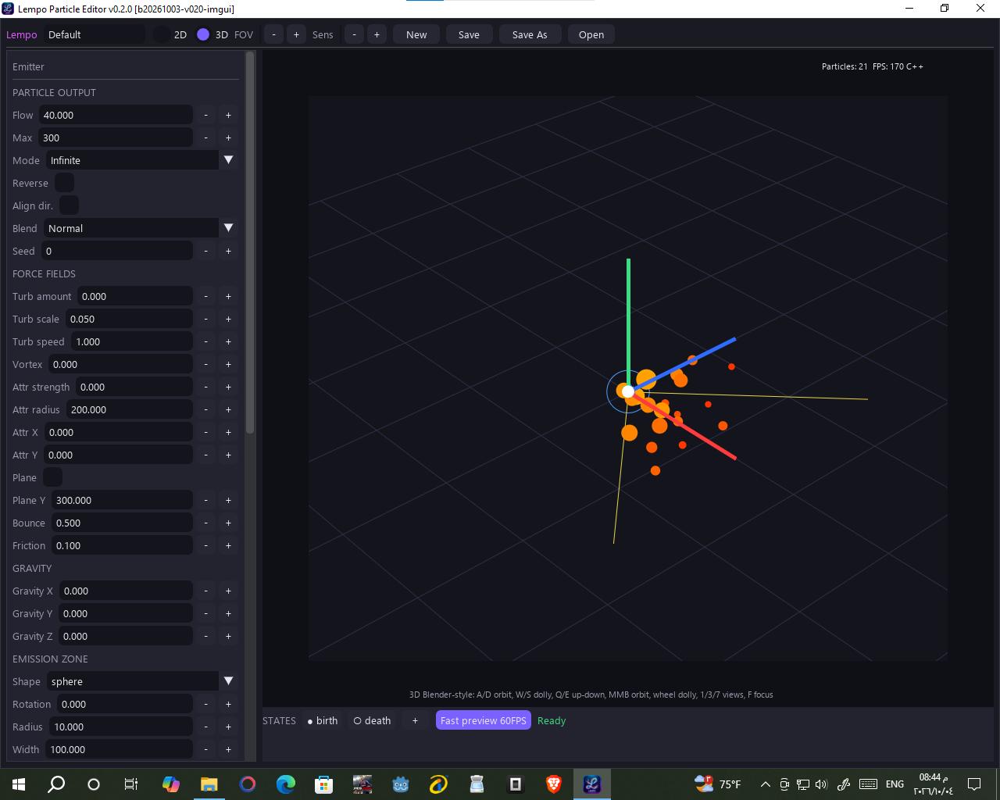
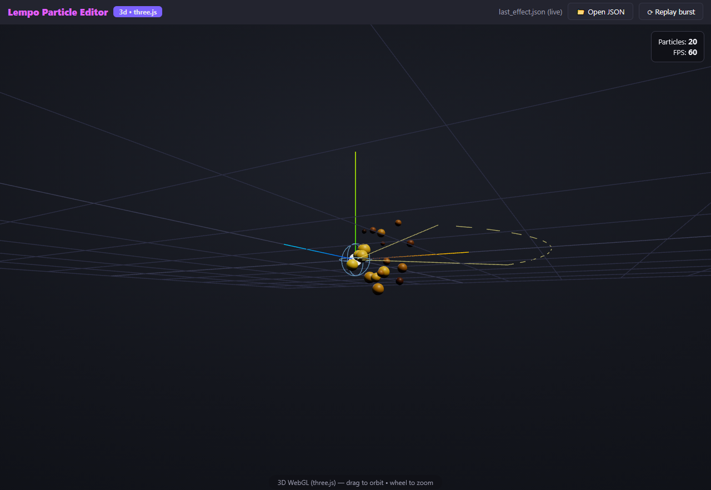
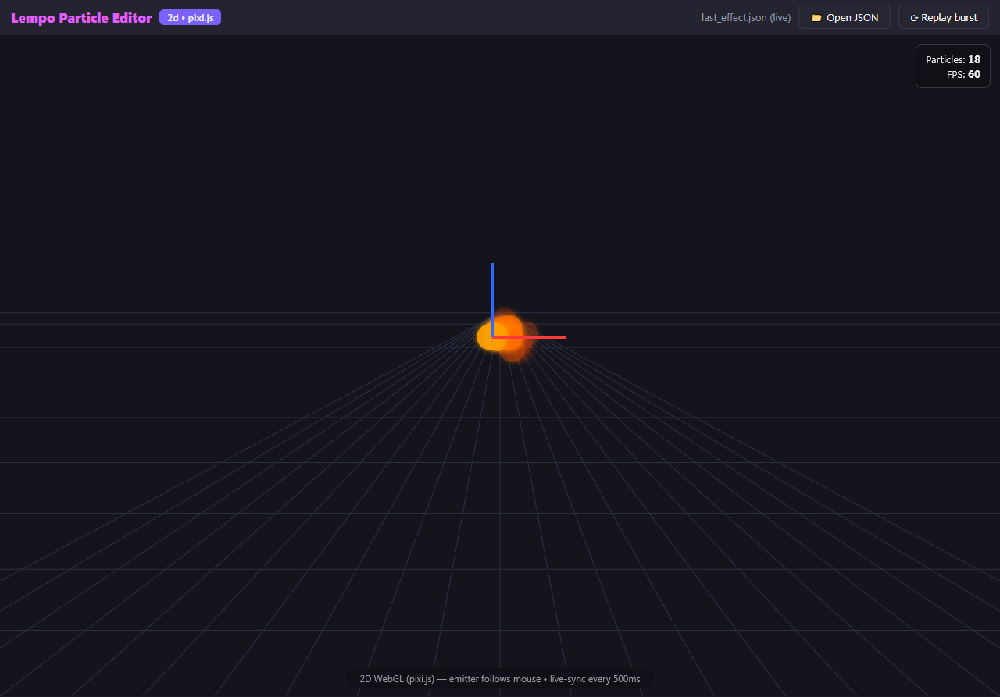

<div align="center">


# Lempo Particle Editor

**Design stunning 2D & 3D particle effects visually — and play them in GDevelop.**

A standalone desktop editor with real-time GPU preview, paired with the **Advanced Particle Emitter** extension for GDevelop.

[](https://github.com/Boy1developer/Lempo-Particle-Editor/releases)
[](LICENSE)
[](https://github.com/Boy1developer/Lempo-Particle-Editor/releases)
[](https://gdevelop.io)
[](https://www.youtube.com/@EG_dev)

[**⬇️ Download**](https://github.com/Boy1developer/Lempo-Particle-Editor/releases) ·
[**✨ Features**](#-features) ·
[**🚀 Quick Start**](#-quick-start) ·
[**🎨 Blend Modes**](#-blend-modes) ·
[**📚 Docs**](#-documentation) ·
[**🛣️ Roadmap**](#️-roadmap)

<br>

<!-- TODO: replace this screenshot with a short demo GIF (editor → in-game), e.g. docs/screenshots/demo.gif -->


</div>

---

## 📖 Overview

Lempo Particle Editor is a two-part toolkit:

| Part | What it is |
| --- | --- |
| **Lempo Particle Editor** | A Dear PyGui desktop app (`LempoParticleEditor.exe`) for designing effects with a live viewport, then exporting them as JSON. |
| **Advanced Particle Emitter** | A GDevelop extension (`AdvancedParticleEmitter.json`) that renders those effects in-game: **2D** via [PixiJS](https://pixijs.com) and **3D** via [Three.js](https://threejs.org). |

Both parts share a single source of truth for particle behavior, shapes, and the export format (see [Shared Contracts](#-shared-contracts)), so an effect looks the same in the editor, the browser preview, and your game.

> Works in any GDevelop project — design the effect in the editor, play it in-game with the Advanced Particle Emitter extension.

---

## 🖼️ Screenshots

<table>
  <tr>
    <td align="center"><br><sub><b>3D viewport</b></sub></td>
    <td align="center"><br><sub><b>2D viewport</b></sub></td>
  </tr>
  <tr>
    <td align="center"><br><sub><b>3D browser fast preview</b></sub></td>
    <td align="center"><br><sub><b>2D browser fast preview</b></sub></td>
  </tr>
  <tr>
    <td align="center"><br><sub><b>Emitter panel</b></sub></td>
    <td align="center"><br><sub><b>Per-state colors (3D)</b></sub></td>
  </tr>
  <tr>
    <td align="center"><br><sub><b>Trails & Ribbons (2D)</b></sub></td>
    <td align="center"><br><sub><b>Trails & Ribbons (3D)</b></sub></td>
  </tr>
</table>

<details>
<summary><b>More screenshots</b></summary>

<table>
  <tr>
    <td align="center"><br><sub>States panel (2D)</sub></td>
    <td align="center"><br><sub>Custom shape</sub></td>
  </tr>
  <tr>
    <td align="center"><br><sub>3D shapes (1)</sub></td>
    <td align="center"><br><sub>3D shapes (2)</sub></td>
  </tr>
  <tr>
    <td align="center" colspan="2"><br><sub>2D shapes</sub></td>
  </tr>
</table>

</details>

---

## ✨ Features

### 🎛️ Editor
- **12 particle shapes** — circle, square, triangle, star, diamond, line, custom, sphere, cube, pyramid, torus, billboard — shared by the 2D and 3D renderers.
- **Custom 3D models & images** — upload `.glb` / `.gltf` / `.obj` (or images for 2D). Models render as themselves in the viewport, the browser preview, and in-game. Rigged/skinned GLBs are baked to their rest pose automatically.
- **Per-state colors** — birth / mid / death each keep their own color. White means natural materials; any other color tints over the base.
- **Gradual shape morph** — birth-to-death shapes cross-fade inside the `(0.25, 0.75)` window instead of snapping (desktop viewport + browser preview; game runtime keeps the classic swap for meshes).
- **Ready-made templates** — Explosion, Fire, Rain, Snow (2D + 3D variants), with 100-step undo/redo.
- **Force fields** *(v1.1)* — age-phased turbulence, Y-axis vortex, linear-falloff attractor, and a bounce/friction collision plane. All off by default (legacy motion stays bit-identical).
- **Deterministic seed** — a nonzero `seed` replays the identical effect everywhere: editor (Python + C++), browser preview, and GDevelop runtime. `0` keeps legacy unseeded behavior.
- **Blend modes** — Normal, Additive, Subtractive, Multiply, Screen, Lighten, Overlay, selectable per emitter (see [Blend Modes](#-blend-modes)).
- **Trails & Ribbons** — a dedicated mode (key `4` for 2D, key `5` for 3D in the startup dialog) with a Unity-style inspector, width/gradient curve editors, `time` / `distance` emission, and a browser of **27 ready-made templates** (combat, magic, movement, nature, stylized) with search, favorites, and your own saved presets. 👉 Full details: [docs/trails.md](docs/trails.md)

> The Dear PyGui sidebar exposes blend, seed, and force-field widgets. The Tk fallback preserves those values on round-trip but has no widgets for them.

### ⚡ Performance
- **InstancedMesh batching (3D primitives)** — ~580 draw calls collapse into ~12 buckets, verified **pixel-identical** per particle (matrix, color, alpha), including morph flips and all blend modes.
- **Lazy buckets & pooled runtime** — empty buckets cost zero draw calls, and shape-aware mesh/material pooling keeps steady state free of per-frame allocations. Automatic fallback to the classic path if instancing is unavailable.
- **Dual simulation core** — a Python reference plus an optional compiled **C++ core** for faster live preview, checked for numerical parity (99/99 cases) against Python.
- **Adaptive viewport** — crisp vector drawlist for small particle counts; above ~900 particles the particle layer renders offscreen and uploads as a texture while guides/gizmo stay vector.

### 🔍 Previews
- **In-editor GPU preview** — a minimal offscreen OpenGL 3.3 renderer built on raw `ctypes` (no PyOpenGL or numpy needed).
- **Browser fast preview** — a self-contained `live_effect.html` (≈1.1 MB, zero network fetches) rendering the same effect live in Three.js (3D) / PixiJS (2D), with 500 ms live-sync. Trail mode renders ribbons in the preview too and hides the particle dots, exactly like the editor viewport.
- **In-game trails (extension v0.2.0)** — exported trail effects render as ribbons inside GDevelop as well (2D quad strips, 3D billboard strips, pooled and blend-aware), with `hideParticle` honored. No new objects: the existing emitters grow trail support, and trail-less effects render bit-identical to before.
- **OS-native file dialogs** — Save / Export / Open use the OS file picker, because Dear PyGui's built-in dialogs return empty results here.

---

## 🚀 Quick Start

### 1. Get the editor

Download `LempoParticleEditor.exe` from the **[Releases](https://github.com/Boy1developer/Lempo-Particle-Editor/releases)** page and run it. No Python installation required. The window title shows `v0.2.0`; it pairs with extension `v0.2.0` and export format `v1.1` (v1.0 files migrate automatically).

**Requirements:** Windows 10/11 (64-bit) · GPU with OpenGL 3.3 support

<details>
<summary><b>Run from source / rebuild</b></summary>

```bash
pip install dearpygui
python editor/studio_imgui.py
```

Tk fallback (shared logic layer, no blend/seed/field widgets — values are preserved):

```bash
python editor/particle_studio.py
```

Rebuild the packaged app (compile check → C++ core build if stale → PyInstaller → smoke test → Windows shortcut):

```bash
python tools/rebuild_app.py
```

This produces `dist/LempoParticleEditor.exe` plus the `Lempo Particle Editor` desktop shortcut (both carry the Lempo icon).

> Binaries (`dist/`, `*.exe`, `*.pyd`, `node_modules/`) are never committed. They are rebuilt locally and shipped through GitHub Releases.

</details>

### 2. Use effects in GDevelop

1. **Design** your effect in Lempo Particle Editor and export it as a `.json` file.
2. **Import** `AdvancedParticleEmitter.json` into your GDevelop project as an extension.
3. **Add** the emitter object to your scene and set its **ParticleJSON** resource to the exported file. If the effect uses a custom model, also set the **Models GLB** resource to your `.glb`.
4. **Run** the preview and enjoy your effect in-game.

> Exact action/condition names depend on the extension version — see the extension's in-editor descriptions.

---

## 🎨 Blend Modes

Set per emitter from the sidebar dropdown. At object level, `BlendingMode: 'JSON'` uses each emitter's own mode; any explicit value forces all emitters.

| Mode | 2D (PixiJS) | 3D (Three.js) | Desktop GL preview | Browser preview |
| --- | --- | --- | --- | --- |
| Normal | normal | normal | `SRC_ALPHA, ONE_MINUS_SRC_ALPHA` | normal |
| Additive | add | additive | `SRC_ALPHA, ONE` | add |
| Subtractive | erase ¹ | subtractive | reverse-subtract | erase ¹ |
| Multiply | multiply | multiply | `DST_COLOR, ONE_MINUS_SRC_ALPHA` | multiply |
| Screen | screen | custom (add + `ONE, ONE_MINUS_SRC_COLOR`) | `ONE, ONE_MINUS_SRC_COLOR` | screen |
| Lighten | → Normal ² | custom max-equation | max | → Normal ² |
| Overlay | overlay | → Normal ³ | → Normal ³ | overlay |

<sub>¹ Pixi core has no subtract · ² Pixi core has no lighten · ³ No fixed-function overlay</sub>

Unsupported combinations fall back to Normal with a **single** `console.warn` — never per frame, never throwing. Extension versions before 0.1.2 don't know Screen / Lighten / Overlay and render them as Normal.

---

## 🤝 Shared Contracts

Everything that must stay identical across Python, C++, the browser preview, and the GDevelop extension lives in one place: [`contracts/contracts.json`](contracts/contracts.json) — particle record layout, `SHAPE_ORDER`, easings, blend modes, export schema, and morph window.

**Edit the JSON, run `tools/generate_contracts.py`, never the generated outputs.** CI fails on stale files or drifted consumers.

**Export format v1.1** is validated on save and load, and `migrate_effect()` heals old files automatically (v1.0 → v1.1, missing blend mode / seed, camelCase easings).

👉 Full details (generated bindings, consumers, particle record layout): [docs/contracts.md](docs/contracts.md)

---

## 🗂️ Project Structure

| Folder | Contents |
| --- | --- |
| `editor/` | Desktop app — Dear PyGui UI (`studio_imgui.py`), Tk fallback and shared logic layer (`particle_studio.py`) |
| `core/` | C++ simulation core (`particle_core.cpp`) + parity and behavior tests |
| `render/` | In-editor OpenGL renderer and render tests |
| `preview/` | Browser fast preview (Three.js / PixiJS) and its tests |
| `carrots-runtime/` | TypeScript runtime copy used by the GDevelop extension |
| `contracts/` | Shared contracts (`contracts.json`) and generated bindings (`gen/`) |
| `assets/` | App icon and bundled presets (`presets/trails/`) |
| `presets/` | Effect presets |
| `bench/` | Benchmarks |
| `packaging/` | Build / packaging files for the Windows app |
| `tests/` | Python test suite |
| `tools/` | Build, contract-generation, and CI helper scripts |
| `docs/` | Documentation and screenshots |

---

## 🧪 Testing

CI runs the parity, behavior, and contract checks on every push (`.github/workflows/ci.yml`). Highlights: Python ↔ C++ parity (**99/99**), seed replay, force fields, blend modes, trails, and the shipped GDevelop runtime tested headlessly.

👉 Full test matrix: [docs/testing.md](docs/testing.md)

---

## 📚 Documentation

| Doc | What's inside |
| --- | --- |
| [docs/trails.md](docs/trails.md) | Trails & Ribbons — modes, emit types, template format, adding your own template, C++ API |
| [docs/contracts.md](docs/contracts.md) | Shared contracts, generated bindings, export format, particle record layout |
| [docs/testing.md](docs/testing.md) | Full test matrix |
| [APP_STRUCTURE.md](APP_STRUCTURE.md) | App architecture notes |
| [PROGRESS.md](PROGRESS.md) | Development progress log |

---

## 🛣️ Roadmap

**Done**
- [x] Ready-made effect templates (Explosion, Fire, Rain, Snow)
- [x] CI for parity and behavior tests
- [x] Screenshots and a step-by-step GDevelop guide
- [x] InstancedMesh batching, lazy buckets, sampling diet *(v0.1.2)*
- [x] Screen / Lighten / Overlay blend modes *(v0.1.2)*
- [x] Deterministic seed + force fields *(v0.1.2)*
- [x] Trails & Ribbons renderer (79-key TRAIL_SCHEMA, 27 templates, Godot-style distance emission, C++ registry + DPG browser) *(v0.2.0)*
- [x] Template browser with search, favorites, and user presets + world-space 2D zoom
- [x] Over-life Bézier curves and gradient editor

**Planned**
- [ ] Flipbook animation, UV scroll, soft particles
- [ ] Effect node tree with parent/child emitters and sub-emitters
- [ ] Timeline with scrubbing and a preset gallery
- [ ] Golden-image tests (editor render vs browser preview)

---

## 👤 Author

**Mostafa Fathy (EG dev)** — independent developer ([@Boy1developer](https://github.com/Boy1developer)).

🎬 YouTube: [youtube.com/@EG_dev](https://www.youtube.com/@EG_dev)

## 📦 Third-Party

| Library | License | Used for |
| --- | --- | --- |
| [Dear PyGui](https://github.com/hoffstadt/DearPyGui) | MIT | Desktop editor UI |
| [Three.js](https://threejs.org) | MIT | 3D rendering (browser preview + GDevelop extension) |
| [PixiJS](https://pixijs.com) | MIT | 2D rendering (browser preview + GDevelop extension) |

## 📄 License

Released under the [MIT License](LICENSE).

<div align="center">

<br>

Made by **Mostafa Fathy (EG dev)** · [🎬 YouTube](https://www.youtube.com/@EG_dev) · If this helps your game, consider giving it a ⭐

</div>
